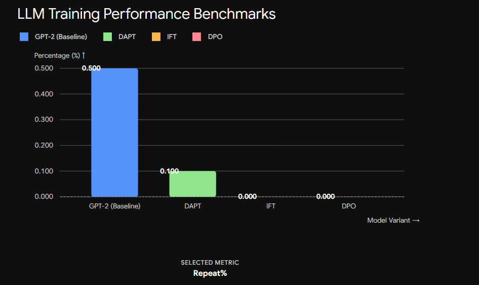
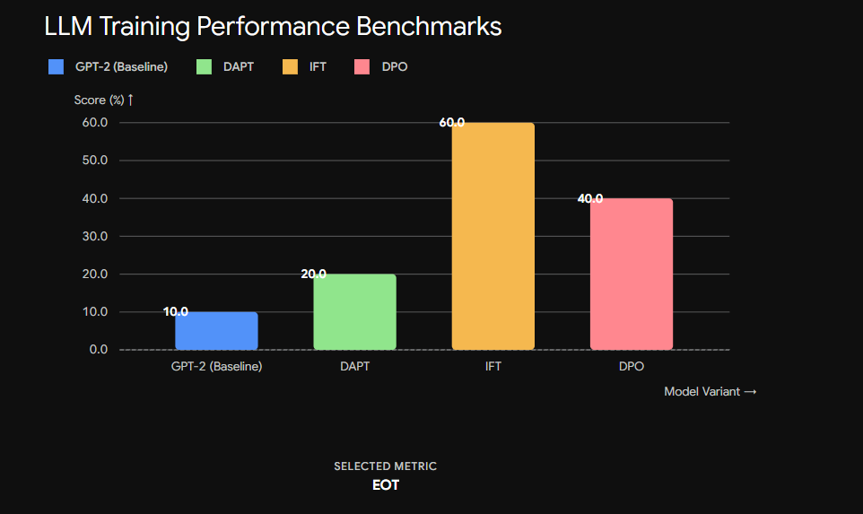
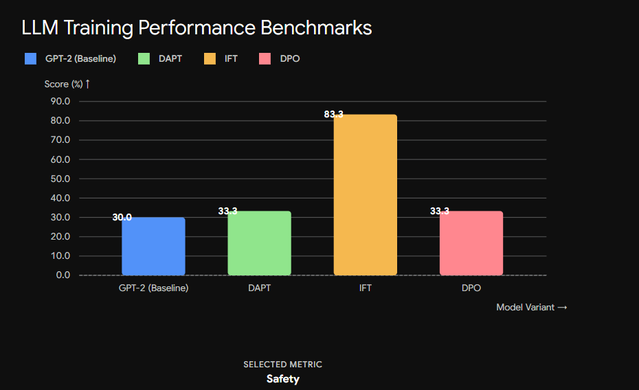
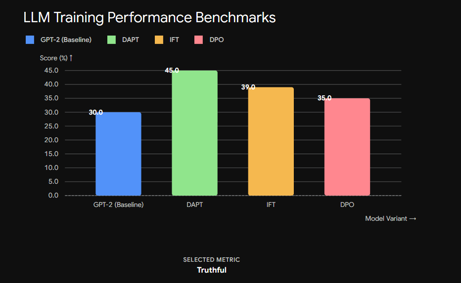
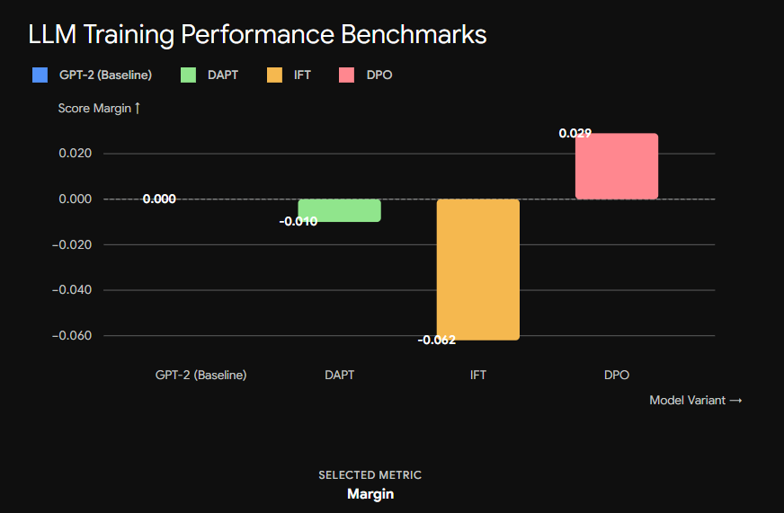
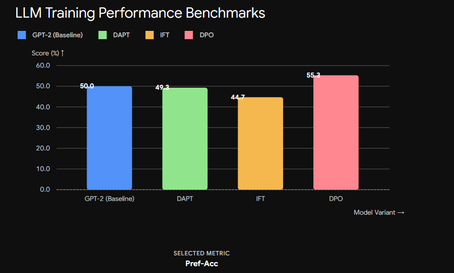
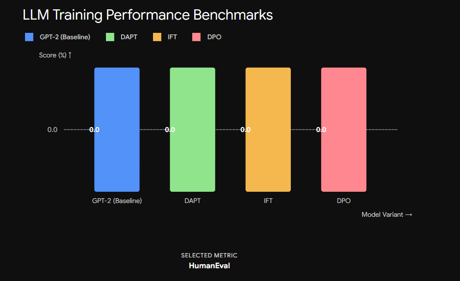
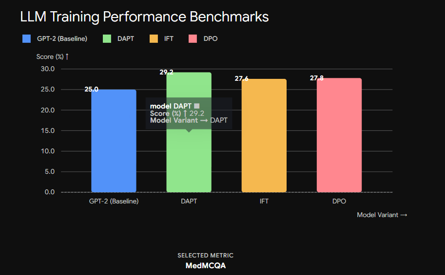
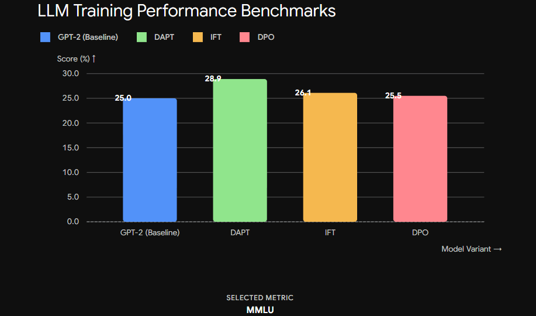

# LatentGPT — Building a GPT-Style LLM From Scratch

This repo documents an iterative, from-scratch journey through building GPT-style language models in PyTorch — starting from a simple character-level bigram model and ending with a full **pretrain → domain-adapt → instruction-tune → align (DPO) → evaluate** pipeline for a small medical-domain LLM. Everything is trained on Kaggle (single P100 GPU, 16GB VRAM), using memory-mapped (`memmap`) token datasets so multi-GB corpora never have to be loaded into RAM.

## Project Goals

1. Implement a GPT-style transformer **entirely from scratch** (no HuggingFace model classes) to understand every component: tokenization, embeddings, attention, normalization, feed-forward blocks, and the training loop.
2. Scale from a tiny character-level model to a ~70M parameter transformer trained on 1B+ tokens using `memmap` for memory-efficient data loading.
3. Explore modern architectural components popularized by recent open LLMs:
   - **GQA** (Grouped Query Attention)
   - **MHA** (Multi-Head Attention)
   - **MLA** (Multi-head Latent Attention, DeepSeek-V2 style, with low-rank Q/KV projections)
   - **RMSNorm** instead of LayerNorm
   - **RoPE** (Rotary Position Embeddings) instead of learned absolute position embeddings
   - **SwiGLU** feed-forward blocks
5. Build a complete, reproducible **LLM training pipeline** (not just pretraining) for a medical-domain assistant:
   `Wikipedia pretraining → Domain-Adaptive Pretraining (PubMed) → Instruction Fine-Tuning (medical QA) → DPO alignment → Full capability + alignment evaluation`.

---

## Architectures Explained
1. **End-to-End Alignment Pipeline — `MLA-with_DAPT_IFT_DPO_Evaluation_70M.ipynb`** Full LLM pipeline: Pretrain → DAPT → IFT → DPO → Eval
   - **Base Model Architecture:** Multi-head Latent Attention (MLA) backbone (`n_embd=512`, `n_head=8`, `n_layer=6`, `block_size=512`) featuring low-rank Q/KV compression, decoupled RoPE, and RMSNorm.
   - **Stage 1: Domain-Adaptive Pretraining (DAPT)**
     - **Dataset:** PubMed corpus (`ccdv/pubmed-summarization`), streamed and tokenized using GPT-2 encoding into a 5GB (~1.34B tokens) memory-mapped (`np.memmap`) binary dataset.
     - **Objective:** Continues self-supervised next-token prediction starting from the general Wikipedia-pretrained checkpoint to adapt vocabulary and latent representations to medical/scientific literature.
   - **Stage 2: Instruction Fine-Tuning (IFT)**
     - **Datasets:** Aggregates 5 real-world medical QA sources: PubMedQA (`pubmed_qa`), Medical Meadow WikiDoc (`medalpaca/medical_meadow_wikidoc`), Medical Meadow Flashcards, Medical Meadow Patient Info, and ChatDoctor (`lavita/ChatDoctor-HealthCareMagic-100k`).
     - **Loss Mechanics:** Implements **Prompt Masking**. Prompts are formatted as `### Instruction:\n{instruction}\n\n### Response:\n{response}`. Target label tokens corresponding to the instruction are assigned `IGNORE_INDEX` (`-1`), ensuring `F.cross_entropy` loss is calculated **strictly on response tokens**, preventing model capacity waste on prompt prediction.
   - **Stage 3: Direct Preference Optimization (DPO)**
     - **Dataset:** Preference pairs from `TsinghuaC3I/UltraMedical-Preference` (`chosen` vs. `rejected` medical responses).
     - **Loss Mechanics:** Trains the active policy model against a **frozen deep-copy reference model** (initialized from the post-IFT checkpoint). Maximizes the reward margin using the standard DPO loss:
       $$\mathcal{L}_{\text{DPO}} = -\log \sigma \left( \beta \cdot \left[ \left(\log \pi_\theta(y_w|x) - \log \pi_{\text{ref}}(y_w|x)\right) - \left(\log \pi_\theta(y_l|x) - \log \pi_{\text{ref}}(y_l|x)\right) \right] \right)$$
       with prompt masking applied to evaluate per-sequence log probabilities strictly over response tokens.
   - **Stage 4: Comprehensive Evaluation Suite (Capability + Alignment)**
     - **Capability Metrics:**
       - **MMLU (`cais/mmlu`):** Multiple-choice general knowledge across 57 subjects (likelihood scoring).
       - **MedMCQA (`openlifescienceai/medmcqa`):** Domain-specific medical entrance exam QA (likelihood scoring).
       - **HumanEval (`openai_humaneval`):** Python coding capability evaluated via functional execution (`pass@1`).
     - **Alignment Metrics:**
       - **Preference Accuracy & Reward Margin:** Evaluated on held-out test pairs from `UltraMedical-Preference`.
       - **TruthfulQA (`truthful_qa`):** Measuring resistance to common misconceptions and hallucinations.
       - **Safety Check:** Evaluated on medical-domain risk prompts for appropriate disclaimers and refusal rates.
       - **Format Adherence & Degeneracy:** Measures End-Of-Text stopping rates and n-gram repetition percentages.

2. **Multi-Head Attention (MHA) — `MHA_70M.ipynb`**
   - **Components:** MHA (scaled dot-product, causal mask), RMSNorm (pre-norm), learned absolute positional embeddings, GELU FFN (4× expansion), AdamW with cosine LR decay, mixed-precision (AMP), gradient accumulation, memmap data loading.
   - **Benefits:** Provides the standard baseline — each head independently learns Q/K/V projections giving maximum representational flexibility. Simple to implement and debug, making it the reference point for comparing all other variants.

3. **Grouped-Query Attention (GQA) — `GQA_68M.ipynb`**
   - **Components:** GQA (`n_kv_heads = n_head // 4`, KV heads repeated to match query heads), RoPE (rotary positional embeddings, precomputed cos/sin buffers), RMSNorm (pre-norm), GELU FFN (4× expansion), **no learned positional embeddings**, memmap data loading.
   - **Benefits:** Reduces the KV cache size by 4× compared to MHA (fewer KV heads) while preserving per-query expressivity. RoPE replaces absolute positional embeddings, encoding relative position directly into the attention scores — this generalizes better and avoids the RoPE + absolute embedding conflict found in early experiments.

4. **Multi-head Latent Attention (MLA) — `MLA_70M.ipynb`**
   - **Components:** MLA with low-rank Q compression (`W_dq`, `W_uq`, `q_layernorm`) and low-rank KV compression (`W_dkv`, `W_ukv`, `kv_layernorm`), decoupled RoPE (applied only to a slice of each head: `qk_rope_dim`), RMSNorm (pre-norm), GELU FFN (4× expansion), **no learned positional embeddings**, memmap data loading.
   - **Benefits:** Aggressively compresses the KV cache by projecting K and V through a shared low-rank bottleneck before up-projecting — the stored latent is much smaller than full KV pairs. The decoupled RoPE design applies rotary encoding to only half the head dimension, leaving the other half as "nope" (non-positional) features that can carry content-only information. Best validation loss (3.29) among all English variants.

5. **K=V Attention — `K=V_attention.ipynb`**
   - **Components:** Causal attention with V reused from K (only `q_proj` and `k_proj`, no `v_proj`), SwiGLU FFN (gated activation: `SiLU(x₁) * x₂`, 4× expansion), RMSNorm (pre-norm), learned positional embeddings (`nn.Parameter`), memmap data loading.
   - **Benefits:** Eliminates the entire V projection — halving KV parameter count and memory. SwiGLU replaces GELU in the feed-forward block, providing a gated nonlinearity that has been shown to improve training efficiency in modern LLMs (PaLM, LLaMA). This notebook serves as an architectural probe to test these two ideas at small scale.

6. **Character-level Hindi — `Hindi-char-llm-5m.ipynb`**
   - **Components:** MHA (per-head Q/K/V with causal mask), LayerNorm (pre-norm), learned absolute positional embeddings, GELU FFN (4× expansion), raw character vocabulary (156 chars).
   - **Benefits:** Zero-dependency baseline — no tokenizer needed. Validates the full training pipeline end-to-end (attention, loss, generation) before investing in tokenization or scale. Uses LayerNorm (not RMSNorm), following the original nanoGPT design.

7. **BPE Hindi — `Hindi-bytepair-LLM-72m.ipynb`**
   - **Components:** MHA (per-head Q/K/V with causal mask), LayerNorm (pre-norm), learned absolute positional embeddings, GELU FFN (4× expansion), custom BPE tokenizer (45k vocab, trained on Hindi Wikipedia), two-pass memmap tokenization, resumable checkpointing.
   - **Benefits:** BPE compresses Hindi text ~10× vs characters, giving the model far more context per sequence. The two-pass memmap strategy (count tokens → pre-allocate → write) handles multi-GB corpora without loading everything into RAM. Resumable training from checkpoint enables long runs on time-limited platforms like Kaggle.

    
| Variant | Key idea | Params | Final Val Loss | Val PPL | Training time | Iteration | GPU | Total Tokens |
| --- | --- | --- | --- | --- | --- | --- | --- | --- |
| **MHA_70M** | Standard multi-head attention| ~70.6M| 3.5580| 35.09| 9h 37m 11s| 75k| Tesla P100-PCIE-16GB| ~1.2B|
| **GQA_68M** | Grouped-Query Attention | 68.0M| 3.3109| 27.41| 9h 56m 31s|  75k| Tesla P100-PCIE-16GB| ~1.2B|
| **MLA_70M** | DeepSeek-style Q/KV compression| 69.9M| 3.2922| 26.90| 11h 18m 35s| 75k| Tesla P100-PCIE-16GB| ~1.2B|
| **K=V_attention** | Shared Key and Value vectors| 75M| - | -| 45m | 45k | Tesla P100-PCIE-16GB | ~1.2B|
| **Hindi-bytepair-LLM** | Custom BPE tokenizer for Hindi| 71.86M| 4.0870 | 59.56 | 6h 26m 39s | 80k | Tesla P100-PCIE-16GB| ~45.6M |
| **Hindi-char-llm** | Character-level GPT for Hindi| 4.9M| 1.3630| 1.3630 | 23m 30s| 12k| Tesla P100-PCIE-16GB | -|

#GPT-2 124M V/S MLA-with_DAPT_IFT_DPO_Evaluation_70M

  
  
  

  
  
  

  
  
  

